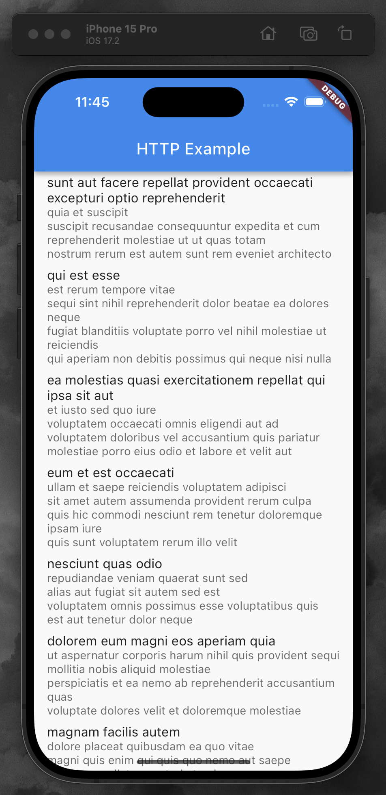

# HTTP 통신 예제 앱

## 프로젝트 소개

이 앱은 HTTP 통신을 연습하고 이해하기 위해 제작되었습니다. 
여기에는 JsonPlaceholder라는 더미 데이터 API를 사용한 네트워크 통신 코드 예제가 포함되어 있습니다.

## 기능 설명

- **데이터 표시**: JsonPlaceholder에서 제공하는 API를 통해 가상의 데이터를 가져와 화면에 표시합니다.

- **통신 연습**: HTTP GET 요청을 보내고 응답을 처리하는 방법을 실습합니다.

## 기술적 구현

- **Flutter**: 크로스 플랫폼 애플리케이션 개발을 위해 Flutter 프레임워크를 사용하였습니다.

- **HTTP 통신**: Dart의 http 패키지를 사용하여 네트워크 요청을 보내고 응답을 받습니다.

- **JsonPlaceholder API**: 더미 데이터를 쉽게 테스트할 수 있도록 만들어진 공개 API를 활용합니다.

